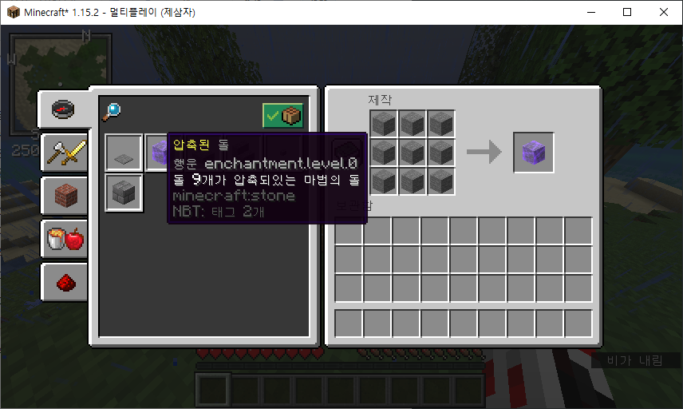
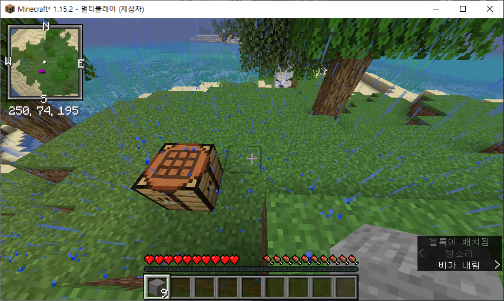
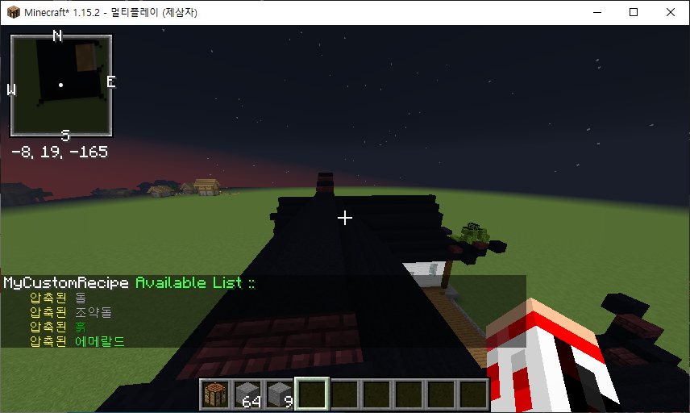
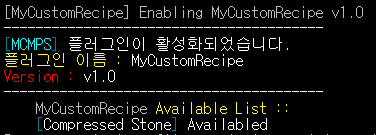

# My Custom Recipe
  > Update date : 2020 / 5 / 9

## 용도
  > 마인크래프트 수집컨텐츠용 플러그인

## 기능
  * 아이템 사용법을 추가함
    1. 같은 아이템을 9개를 조합하여 압축된 아이템 생성  
      
    2. 압축된 아이템은 우클릭하여 분해함  
      
  * 적용된 아이템을 확인할 수 있는 명령어를 추가함  
    

## 플러그인 적용 버전
  - **Spigot 1.15.2**  
  

## 아이템 추가
  - 파일 입출력을 적용하여 **더 많은 커스텀 조합법 추가 가능**
### 추가 방법
  - 플러그인을 적용하여 나오는 MyCustomRecipe의 recipe.txt 파일을 수정하여 조합법 추가
### recipe.txt
  - 파일 입력 예시  
  ```
  name: "compressedstone"
	customName: "Compressed Stone"
	display: "§e압축된 §7돌"
	lore:
		"§f돌 9개가 압축되있는 마법의 돌"
	material: STONE
	resultItem: STONE
  ```
  - 파일 타입 : **ShapelessRecipe**
  - 기본 추정 : **같은 재료 9개**를 이용한 *ShapelessRecipe*를 이용하여 *CustomItem* 제작
  - Key
    1. name: => 커스텀 조합법의 *Key* 값
    2. customName: => 적용된 후 버킷에 나오는 *이름* 값
    3. display: => 게임 내에서의 아이템 *이름* 값
    4. lore: => 게임 내에서의 아이템 *설명* 값
      - 다음 key값이 나오기 전까지 **계속해서 설명을 넣을 수 있음**
    5. material: => 아이템을 조합하기 위해 사용하는 재료의 *아이템* 값
    6. resultItem: => 커스텀 아이템의 *아이템* 값
  * **만약 한글이 깨진다면**
    - "recipe.txt" 파일을 *ANSI*로 **인코딩**할 것

## 명령어
  1. /recipe   
    - 플러그인의 명령어를 봅니다
  2. /recipe reload  
    - "recipe.txt" 파일을 리로드합니다
  3. /recipe list  
    - 서버에 적용된 커스텀조합법의 결과물 리스트를 확인합니다

## 버전
### Version 1.2
  - [**-**] */recipeReload* 명령어 제거
  - [**+**] 명령어 추가
    - */recipe*
    - */recipe reload*
    - */recipe list*
  - [**☆**] 분해할 아이템을 1개 이상 들고 있을 때, **분해되지 않던 오류** 수정
### Version 1.1
  - [**-**] 압축된 돌 레시피 제거
  - [**+**] 파일 입출력 추가 ( 더 많은 커스텀 조합법 추가 가능 )
  - [**+**] 플러그인 리로드 명령어 추가  
    - */recipeReload* :: *recipe.txt* 파일을 리로드합니다
### Version 1.0
  - [**+**] 플러그인 서버에 적용
  - [**+**] 압축된 돌 레시피 추가
  - [**+**] 아이템 분해방법 추가

## 수정일
  > 2020 / 5 / 10